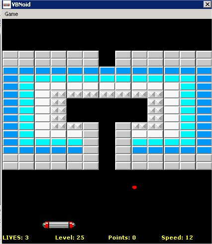

<div align="center">

## VBnoid


</div>

### Description

Just another Arkanoid clone. Includes some powerups and a level editor. Code in plain VB (not DX) created as a simple learning project for my teaching class. Not very special but give it a try.
 
### More Info
 
Using Windows Scripting Library for file access.


<span>             |<span>
---                |---
**Submitted On**   |2002-12-17 17:42:12
**By**             |[Zissopoulos John](https://github.com/Planet-Source-Code/PSCIndex/blob/master/ByAuthor/zissopoulos-john.md)
**Level**          |Beginner
**User Rating**    |4.7 (47 globes from 10 users)
**Compatibility**  |VB 6\.0
**Category**       |[Games](https://github.com/Planet-Source-Code/PSCIndex/blob/master/ByCategory/games__1-38.md)
**World**          |[Visual Basic](https://github.com/Planet-Source-Code/PSCIndex/blob/master/ByWorld/visual-basic.md)
**Archive File**   |[VBnoid15149812172002\.zip](https://github.com/Planet-Source-Code/zissopoulos-john-vbnoid__1-41668/archive/master.zip)

### API Declarations

```
Private Declare Function GetCursorPos Lib "user32" (lpPoint As POINTAPI) As Long
Private Declare Function PlaySound Lib "winmm.dll" Alias "PlaySoundA" (ByVal lpszName As String, ByVal hModule As Long, ByVal dwFlags As Long) As Long
Private Declare Function GetSystemMetrics Lib "user32" (ByVal nIndex As Long) As Long
Private Declare Function GetWindowLong Lib "user32" Alias "GetWindowLongA" (ByVal hwnd As Long, ByVal nIndex As Long) As Long
```


